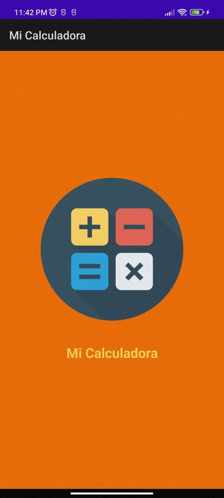
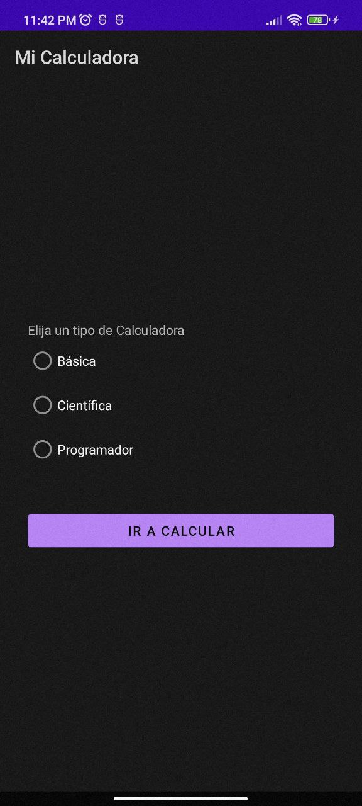
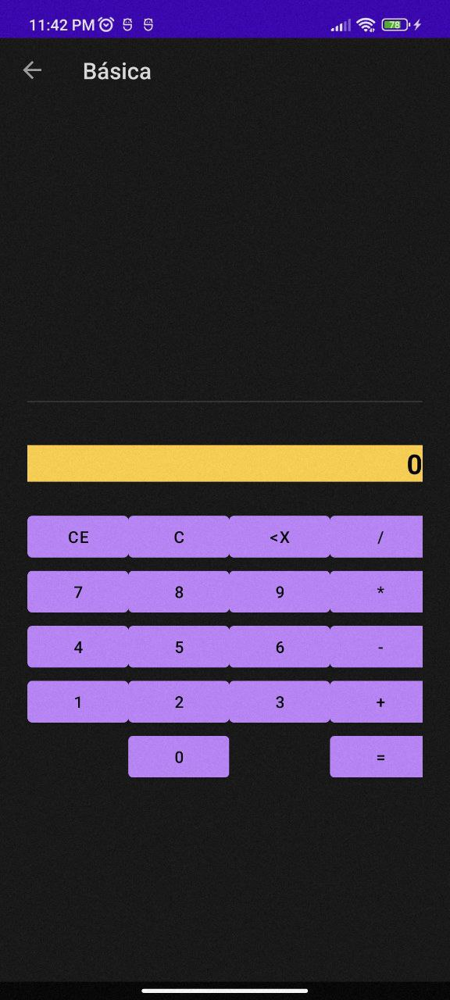
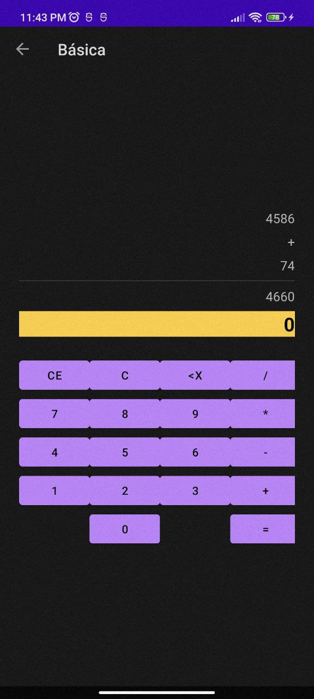

# Ejemplo de Calculadora

Aplicativo Android de Calculadora.

## Funciones
* Básico
* Científica (En construcción)
* Programador (En construcción)

## Capturas

SplashActivity

MainActivity

BasicActivity

BasicActivity Ejemplo Operación
